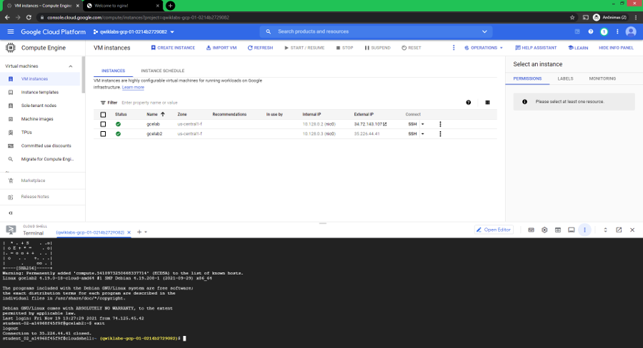

# GCP Primeiros Passos

- Plataforma de Ensino: [Google Cloud Skills Boost](https://www.cloudskillsboost.google/)
- Plataforma de Ensino: [Capacita+ Google](https://inthecloud.withgoogle.com/capacitamais/home.html)

##  Objetivo

- Repositório para acompanhamento da minha evolução em Cloud Computing na Google Cloud Plataform.
- Entender os conceitos, práticar e entregar soluções Cloud Computing e DevOps.
- Entregar soluções modernas para qualquer Cloud (AWS, Azure, GCP), entendendo o conceito e não apenas as configurações dos serviços de uma determinada empresa.
- Backup para empresas
- [Arquitetura Serverless](https://aws.amazon.com/pt/serverless/)
- Refatorar as soluções monolíticas para arquiteturas de microservices

## Autor

- Bruno Gamba Rocha
- [https://www.linkedin.com/in/bruno-gamba-rocha](https://www.linkedin.com/in/bruno-gamba-rocha/)
- [Meu Perfil Público](https://www.cloudskillsboost.google/public_profiles/80d11a1c-af32-4b80-9f13-2648ac766964)

## Tecnologias Utilizadas

- [Serviços GCP](https://cloud.google.com/products#top_of_page)

## Andamento

### Cloud Hero - Infra Skills - 19 de Novembro 2021 - [Qwiklabs](https://cloudonair.withgoogle.com/events/cloud-hero-infra-skills-nov19-pt?talk=talk)
- [x] Tour pelo Qwikilabs e pelo Google Cloud
	- [x] Lab
- [x] Uso de gcloud comandos e Cloud Shell
	- [x] Lab Primeiros passos com o Cloud Shell e a gcloud
- [x] Criação e implantação de máquinas virtuais no Compute Engine
	- [x] Lab Como criar uma máquina virtual
- [x] Exeução de aplicativos em contêineres no Google Kubernetes Engine
	- [x] Lab Kubernetes Engine: Qwik Start

### Google Cloud Fundamentals: Core Infrastructure - 06 de Dezembro 2021 - [Arki 1](https://arki1.com)
- [ ] aguardando evento

### Logging, Monitoring, and Observability in Google Cloud (GO-LMOGC) - 14 a 16 de Dezembro 2021 - [Fast Lane](https://www.flane.com.pa/)
- [ ] aguardando evento

### Links
- [x] [Treinamento do Google Cloud](https://cloud.google.com/training/class-schedule#/language=Portuguese_(Brazilian))

- [x] [Capacita+ Google](https://inthecloud.withgoogle.com/capacitamais/home.html)

- [x] [Compare os serviços da AWS e do Azure com o Google Cloud](https://cloud.google.com/free/docs/aws-azure-gcp-service-comparison/)

- [x] [Google Cloud Skills Boost](https://www.cloudskillsboost.google/)

- [x] [APIs Explorer: Qwik Start | Google Cloud Skills Boost](https://www.cloudskillsboost.google/focuses/2457?parent=catalog)

- [x] [Regiões e zonas](https://cloud.google.com/compute/docs/regions-zones/)

- [x] [IAM - Identity and Access Management](https://cloud.google.com/iam/)

- [x] [IAM - Understanding roles](https://cloud.google.com/iam/docs/understanding-roles/#primitive%5C_roles)

- [x] [gcloud - Visão geral da ferramenta](https://cloud.google.com/apis/design/)

### Ferramentas

### Vídeos

